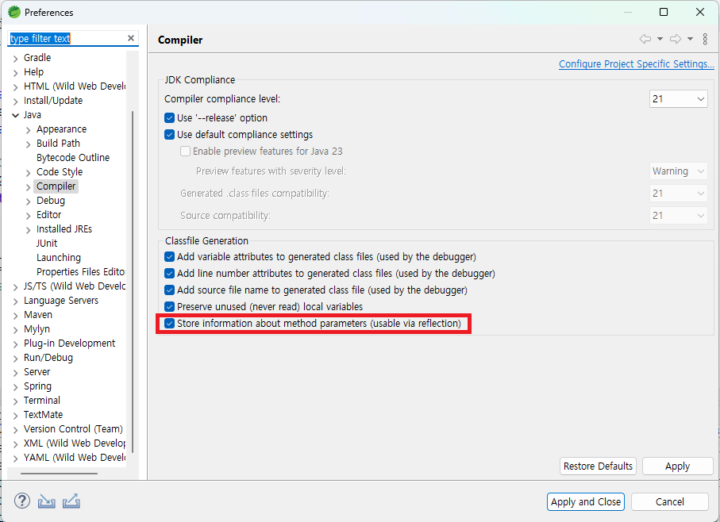

# **Project Muu.t**
### **by 잘하조**

---

## **프로젝트 소개**
### 공연 예매 웹 사이트
- **목적**: 공연 정보를 확인하고 예매 및 결제를 진행할 수 있는 웹 플랫폼
- **개발 환경**:
  - **Backend**: Spring, Oracle SQL Developer, Apache Tomcat
  - **Frontend**: React, Vite
- **프로젝트 기간**: 2024/11.04 ~ 2024/12.26
- **레퍼런스 사이트**: [티켓링크](https://www.ticketlink.co.kr/home)

---

## **역할 분담**
| 이름         | 역할 및 담당 페이지               |
|--------------|-----------------------------------|
| **조장 김영범** | 예매/결제/좌석 배치 에디터 페이지              |
| **박정호**      | 메인페이지/상세페이지               |
| **임지수**      | 회원가입/로그인/마이페이지/관리자페이지          |
| **안선우**      | ERD 설계                         |

---

## **구현 기능**
- **메인 페이지**:  
    공연 목록 확인 및 선택
- **회원가입 및 로그인**:  
    사용자 관리 및 인증 기능
- **상세 페이지**:  
    공연 정보와 좌석 선택
- **예매 및 결제**:  
    좌석 선택 후 예매 및 결제 처리
- **좌석 배치 에디터 페이지**:  
    좌석 배치도에 따라 관리자가 직접 좌석을 배치
- **마이 페이지**:  
    예매 내역 확인 및 사용자 정보 관리
- **관리자 페이지**:  
    공연장, 좌석 정보 및 회원 정보 관리

---

## **실행 방법**

### 1. **프로젝트 클론**
```bash
git clone https://github.com/kybxdc/Muu.t.git
```

### 2. **Backend 실행**
- **설정**:
  - **서버**: Apache Tomcat
  - **포트**: `localhost:9090`
- **기동 방법**:
  - STS에서 프로젝트를 `Run As > Spring Boot App`으로 실행

### 3. **Frontend 실행**
- **환경**: Visual Studio Code(VSCode)
  - **Node.js 설치 필요**: [Node.js 공식 사이트](https://nodejs.org/)에서 최신 LTS 버전을 설치하세요.
- **경로**: `Front-end/main_page`
- **설치**:
  ```bash
  npm install
  ```
- **기동**:
  ```bash
  npm run dev
  ```
- **접속**:
  - **Backend 및 초기 데이터 삽입**: [http://localhost:9090](http://localhost:9090)  
    - 초기 데이터 삽입은 해당 주소에서 진행할 수 있습니다.
  - **Frontend**: [http://localhost:5173](http://localhost:5173)  
    프론트엔드 애플리케이션은 위 주소에서 실행됩니다.

---

## **주의사항**
- **Backend와 Frontend 모두 실행 필수**:  
  백엔드와 프론트엔드 서버가 동시에 실행되어야 정상적으로 모든 기능을 사용할 수 있습니다.
  
- **데이터베이스 설정**:  
  프로젝트는 **Oracle Database**를 사용하며, 데이터베이스 설정은 다음을 참고하세요:  
  - **데이터베이스 이름**: XE  
  - **JDBC URL**: `jdbc:oracle:thin:@localhost:1521:xe`  
  - **사용자 이름**: `finalproject2`  
  - **비밀번호**: `1234`  

- **테이블 생성 방법**:  
  데이터베이스 테이블을 자동으로 생성하려면 `application.properties` 파일에서 설정을 변경해야 합니다.  
  - **파일 경로**:  
    `Back-end/muut/src/main/resources/application.properties`
  - **설정 변경**:  
    아래 설정을 활성화합니다:
    ```properties
    spring.jpa.hibernate.ddl-auto = create
    ```
    서버 실행 시 데이터베이스 테이블이 자동으로 생성됩니다.
  - **설정 복원**:  
    데이터베이스 테이블 생성 후, 설정을 다시 아래와 같이 변경하거나 주석 처리하여 데이터베이스를 보호하세요:
    ```properties
    spring.jpa.hibernate.ddl-auto = none
    ```

- **DBeaver 사용**:  
  데이터베이스 관리를 위해 DBeaver를 사용하며, 위의 설정과 동일한 DB 연결 정보를 사용해야 합니다.

- **포트 충돌 주의**:  
  백엔드(`localhost:9090`)와 프론트엔드(`localhost:5173`)가 동일한 포트를 사용하지 않도록 설정되어 있습니다. 포트 충돌이 발생하면 수동으로 수정해야 합니다.

- **Spring method parameters 주의**:
  java.lang.IllegalArgumentException: Name for argument of type [java.lang.Long] not specified, and parameter name information not available via reflection. Ensure that the compiler uses the '-parameters' flag.
  위의 IllegalArgumentException 오류 발생 시 STS의 컴파일러 설정이 잘못되었을 가능성이 있습니다.
  이 경우, 아래의 사진처럼 Window > Preferences > Java > Compiler > Classfile Generation에서 "Store information about method parameters (usable via reflection)" 옵션을 체크해주면
  컴파일 시 매개변수 이름 정보가 class 파일에 저장되도록 하여 오류가 해결될 것입니다.
  

- **결제 방법**:
  1. 카드등록
  2. 비밀번호 등록(본 계정이라 다른거 ok)
  3. 카드사 상관없이 선택
  4. 카드 비밀번호, 카드번호, 등 전부 1로 채우기 (카드번호의 경우 자릿수는 지켜서)

---

## **프로젝트 자료**
- **PPT**: [발표 자료 링크](docs/Muu.t.pdf)
- **ERD**: [ERD 링크](https://www.erdcloud.com/d/ZrPw9AyMmN9wyPDBs)
